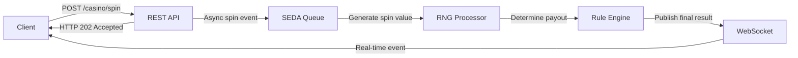

# Exercise #1 - The House Always Wins

## Overview

In this exercise, you will implement a simple yet realistic event-driven casino system using Apache Camel.

A spin request is accepted through a REST API, processed asynchronously through a Camel event pipeline, and the final
result is delivered in real time via WebSocket.



## Your Task

Open `CasinoRoutes.java` and implement the missing Camel routes to support the asynchronous spin workflow:

- Generate and return a unique `spinId` (UUID v4)
- Publish the spin event to a SEDA queue for asynchronous processing
- Invoke the RNG processor to generate the spin value
- Determine the payout using the Rule Engine
- Publish the final result via WebSocket

## Spin Command API (REST)

### Request

```http
POST /casino/spin
```

### Response

HTTP Status: **202 Accepted**

#### Response Body

```json
{
  "spinId": "550e8400-e29b-41d4-a716-446655440000"
}
```

## Result Event Stream (WebSocket)

### Endpoint

```http
ws://localhost:8080/casino
```

### Event Payload

```json
{
  "spinId": "550e8400-e29b-41d4-a716-446655440000",
  "spinValue": 7,
  "payout": "WIN"
}
```

> **Note:** The house always wins... eventually. Don't be surprised if the Rule Engine has its little preferences.

## Provided Components

The following are ready-to-use and require no modification:

| Component            | Role                                                        |
|----------------------|-------------------------------------------------------------|
| `CasinoRngProcessor` | Generates a secure random spin value                        |
| `CasinoRuleEngine`   | Evaluates a spin value and returns the corresponding payout |

## Validation

Tests are provided in `CasinoRoutesTest.java`. Run `mvn test` to validate your implementation.

All tests passing means your routes correctly handle both the REST endpoint and the WebSocket event stream.