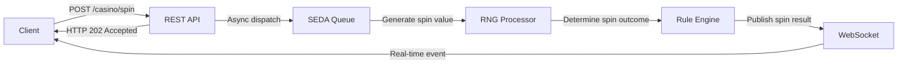

# Lab #1 - The House Always Wins

## Overview

In this lab, you will implement a simple yet realistic event-driven casino system using Apache Camel.

A spin request is accepted through a REST API, processed asynchronously, and the spin
result is delivered in real time via WebSocket.



## Your Task

Open `CasinoRoutes.java` and complete the missing parts of the Camel routes.

- In the `direct:spin` route:
    - Generate a unique `spinId` (UUID v4) and store it as an exchange property
    - Build a REST response containing the `spinId` (HTTP 202, `SpinResponse`)
    - Serialize the response to JSON

- In the `seda:spinQueue` route:
    - Invoke the RNG processor to generate a random `spinValue`
    - Use the Rule Engine to compute the `spinOutcome`
    - Build the WebSocket event payload (`SpinEvent`)
    - Serialize the event payload to JSON

(The REST endpoint, the asynchronous dispatch to SEDA, and the WebSocket publishing are already implemented.)

## REST Contract

### Request

```http
POST /casino/spin
```

### Response

HTTP Status: **202 Accepted**

#### Response Body

```json
{
  "spinId": "550e8400-e29b-41d4-a716-446655440000"
}
```

## WebSocket Contract

### Event Payload

```json
{
  "eventType": "SPIN_RESULT",
  "spinId": "550e8400-e29b-41d4-a716-446655440000",
  "spinValue": 7,
  "spinOutcome": "WIN"
}
```

> **Note:** The house always wins... eventually. Don't be surprised if the Rule Engine is statistically opinionated.

## Provided Components

The following are ready-to-use and require no modification:

| Component            | Role                                                |
|----------------------|-----------------------------------------------------|
| `CasinoRngProcessor` | Generates a secure random spin value                |
| `CasinoRuleEngine`   | Evaluates a spin value and returns the spin outcome |

## Validation

Tests are provided in `CasinoRoutesTest.java`. Run `mvn test` to validate your implementation.

All tests passing means your routes correctly handle the REST endpoint, the SEDA-based asynchronous processing pipeline,
and the final WebSocket event emission.